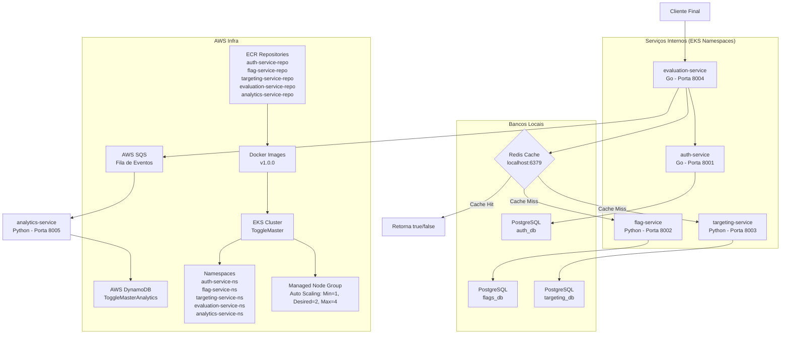

# Arquitetura dos projetos FIAP (ToggleMaster)

Este documento descreve a arquitetura geral dos serviços que compõem o projeto **ToggleMaster**, localizados em `FIAP/`. Cada serviço é responsável por uma parte específica do fluxo de feature flags e comunicação entre eles.

---

## 🧩 Visão Geral da Arquitetura

### Serviços principais

1. **auth-service (Go)**
   - Responsável por **criar e validar chaves de API** usadas pelos demais serviços.
   - Guarda as chaves em um banco PostgreSQL (tabela `api_keys`).
   - Oferece endpoint `/admin/keys` para geração de chaves e `/validate` para validação.
   - Exige `MASTER_KEY` para criar novas chaves.

2. **flag-service (Python)**
   - CRUD de **feature flags** (definições básicas de flags).
   - Toda requisição (exceto `/health`) exige `Authorization: Bearer <KEY>` validada pelo `auth-service`.
   - Guarda flags em banco PostgreSQL (tabela `flags`).

3. **targeting-service (Python)**
   - CRUD de **regras de segmentação** (targeting) para cada flag.
   - Também exige autenticação via `auth-service`.
   - Persistência em banco PostgreSQL (tabela `targeting_rules`).

4. **evaluation-service (Go)**
   - Endpoint público que o cliente final chama: `/evaluate?user_id=...&flag_name=...`.
   - Faz **cache em Redis** para diminuir latência.
   - Se cache é miss, busca:
     - Flag no `flag-service`
     - Regras no `targeting-service`
   - Aplica lógica (ex: percentuais, segmentação) e retorna `true/false`.
   - Envia um evento de decisão para **AWS SQS** (fila usada pelo worker de analytics).

5. **analytics-service (Python)**
   - Worker que consome mensagens da **fila AWS SQS** gerada pelo `evaluation-service`.
   - Persiste eventos em **AWS DynamoDB** (tabela `ToggleMasterAnalytics`).
   - Não expõe endpoints além de um `/health`.

---

## � Diagrama de Arquitetura



Este diagrama ilustra o fluxo principal: o cliente chama o `evaluation-service`, que usa cache e consulta os outros serviços quando necessário, enviando eventos para analytics via SQS/DynamoDB. Inclui também a infraestrutura AWS com EKS, namespaces, ECR, imagens Docker e Managed Node Group.

---

## �🔌 Fluxo de Requisição (Caminho Quente)

1. **Cliente** chama o `evaluation-service` (`/evaluate`).
2. Serviço verifica **Redis**:
   - Cache hit: retorna rapidamente sem chamar outros serviços.
   - Cache miss: faz chamadas HTTP para:
     - `flag-service` para obter definição da flag.
     - `targeting-service` para obter regra de segmentação.
3. Aplica regra (ex: % de usuários, etc.).
4. Retorna resultado (`true/false`).
5. Coloca um evento na **fila SQS** para ser processado pelo `analytics-service`.

---

## 🗄️ Bancos de Dados e Persistência

### PostgreSQL
- Usado por 3 serviços (cada um com seu banco de dados):
  - `auth_db` (auth-service) → tabela `api_keys`
  - `flags_db` (flag-service) → tabela `flags`
  - `targeting_db` (targeting-service) → tabela `targeting_rules`

Cada serviço possui seu próprio script de inicialização em `db/init.sql`.

### Redis
- Cache usado pelo `evaluation-service` para armazenar resultados de avaliações por um curto TTL.

### AWS SQS + DynamoDB
- `evaluation-service` publica eventos na fila SQS.
- `analytics-service` consome a fila e grava em DynamoDB (`ToggleMasterAnalytics`).

#### Diferenças de Propósito entre os Data Stores

No projeto ToggleMaster, três tipos de data stores são utilizados, cada um com propósito específico baseado em suas características:

1. **RDS (PostgreSQL)**:
   - **Propósito**: Armazenamento persistente de dados relacionais estruturados.
   - **Uso no projeto**: Guarda dados críticos como chaves de API (`api_keys`), definições de flags (`flags`) e regras de segmentação (`targeting_rules`). Suporta transações ACID, consultas complexas (JOINs, agregações) e integridade referencial.
   - **Vantagens**: Consistência forte, suporte a esquemas fixos, ideal para operações CRUD frequentes com dados inter-relacionados.
   - **Quando usar**: Para dados que precisam de durabilidade, backup e consultas SQL tradicionais.

2. **ElastiCache (Redis)**:
   - **Propósito**: Cache em memória para acelerar acesso a dados frequentemente acessados.
   - **Uso no projeto**: Cacheia resultados de avaliações de flags para reduzir latência no `evaluation-service`. Armazena dados temporários com TTL (Time-To-Live) curto.
   - **Vantagens**: Velocidade sub-milissegundo, suporte a estruturas de dados complexas (hashes, listas), escalabilidade horizontal.
   - **Quando usar**: Para reduzir carga em bancos primários, melhorar performance de leitura e armazenar sessões ou dados efêmeros.

3. **DynamoDB**:
   - **Propósito**: Banco NoSQL para dados não estruturados ou semi-estruturados, com foco em escalabilidade e alta disponibilidade.
   - **Uso no projeto**: Persiste eventos de analytics (decisões de flags) para análise posterior. Tabela `ToggleMasterAnalytics` com chave primária `event_id`.
   - **Vantagens**: Escalabilidade automática, baixa latência para writes/reads massivos, suporte a dados JSON-like, integração com SQS para processamento assíncrono.
   - **Quando usar**: Para logs, eventos, analytics ou dados que crescem rapidamente e não precisam de consultas complexas/relacionais.

**Resumo**: RDS para dados relacionais persistentes; Redis para cache rápido e temporário; DynamoDB para analytics escaláveis e event-driven.

---

## ☁️ Infraestrutura AWS

A infraestrutura do projeto ToggleMaster é hospedada na AWS, utilizando serviços gerenciados para escalabilidade, segurança e manutenção reduzida.

### Cluster EKS (Elastic Kubernetes Service)
- **Cluster**: Um cluster EKS dedicado para o projeto ToggleMaster.
- **Namespaces**: 5 namespaces separados, um para cada microserviço:
  - `auth-service-ns`
  - `flag-service-ns`
  - `targeting-service-ns`
  - `evaluation-service-ns`
  - `analytics-service-ns`
- Cada namespace isola o microserviço, facilitando gerenciamento de recursos, RBAC e monitoramento.

### Repositórios ECR (Elastic Container Registry)
- Cinco repositórios privados no ECR, um para cada microserviço:
  - `auth-service-repo`
  - `flag-service-repo`
  - `targeting-service-repo`
  - `evaluation-service-repo`
  - `analytics-service-repo`
- Cada repositório armazena as imagens Docker do respectivo serviço.

### Imagens Docker
- Cada microserviço possui sua própria imagem Docker, construída a partir de um `Dockerfile` específico.
- As imagens são versionadas (ex: `v1.0.0`) e armazenadas nos repositórios ECR correspondentes.
- Processo de CI/CD: Build das imagens via GitHub Actions ou similar, push para ECR, e deploy no EKS.

### Managed Node Group
- **Tipo**: Managed Node Group no EKS.
- **Configuração de Auto Scaling**:
  - Mínimo: 1 instância
  - Desejado: 2 instâncias
  - Máximo: 4 instâncias
- **Instâncias**: Recomendadas instâncias otimizadas para computação (ex: t3.medium ou m5.large), dependendo da carga.
- **Benefícios**: Escalabilidade automática baseada em métricas (CPU/Memória), alta disponibilidade e integração nativa com EKS.

---

## 🔒 Autenticação e Segurança

- O **auth-service** é a autoridade de autenticação.
- Os outros serviços (`flag-service`, `targeting-service`, `evaluation-service`) usam chaves de API.
- Cada requisição protegida exige header:
  ```http
  Authorization: Bearer <API_KEY>
  ```

---

## 🛠 Configuração e Execução Local (Resumo)

Cada serviço costuma ser executado localmente em uma porta distinta:

- `auth-service`: 8001
- `flag-service`: 8002
- `targeting-service`: 8003
- `evaluation-service`: 8004
- `analytics-service`: 8005

Cada serviço usa um `.env` para variáveis (POSTGRES, AWS, etc.).

---

## 🧠 Componentes chave (por serviço)

### auth-service (Go)
- `main.go`: inicializa servidor e rotas
- `handlers.go`: lógica de criação/validação de keys
- `db/init.sql`: tabela `api_keys`

### flag-service (Python)
- `app.py`: configura Flask + rotas
- `db/init.sql`: tabela `flags`

### targeting-service (Python)
- `app.py`: configura Flask + rotas
- `db/init.sql`: tabela `targeting_rules`

### evaluation-service (Go)
- `main.go`: servidor e rotas
- `evaluator.go`: lógica de avaliação (resolução de regras e cache)
- `sqs.go`: envio de eventos para SQS

### analytics-service (Python)
- `app.py`: worker que consome SQS e grava DynamoDB

---

## 📌 Observações Gerais

- A arquitetura é **modular**: cada serviço tem responsabilidade única e APIs bem definidas.
- O `evaluation-service` é o ponto de integração entre os serviços internos e sistemas externos (Redis + AWS).
- O `auth-service` garante segurança, isolando o gerenciamento de chaves de API.
- **Infraestrutura AWS**: Os serviços são implantados em um cluster EKS com isolamento por namespaces, utilizando ECR para armazenamento de imagens Docker e Managed Node Groups para escalabilidade automática.

---

## ✅ Próximos passos sugeridos

- Mapear o contrato exato de mensagens enviadas para a fila SQS (camada `evaluation-service -> analytics-service`).
- Documentar as estruturas de dados (JSON) de `flags` e `rules`.
- Versionar APIs / adicionar OpenAPI (Swagger) caso necessário.
